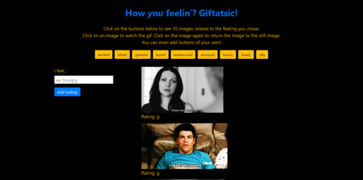

# gifTastic

## Contributors

kd101jp14

## Technology

* HTML5
* CSS3
* Bootstrap 4
* JavaScript
* jQuery 3
* GIPHY API

## Live demo:
https://kd101jp14.github.io/gifTastic/

## About

This web application displays several buttons, which are named different feelings/emotions. When the user clicks on a button, 10 still images, which are retrieved from the GIPHY API, appear on the page. The user may click on the images to turn them into gifs. By clicking the images again, the user may return the gifs to still images. The user may also create more feeling/emotion buttons by typing them in the input field and pressing the submit button. The added buttons also display still images and gifs.

### The challenge

The primary challenge for this project included getting the images to display an animated gif or a still image when the user clicked on the image. For quite some time, the images would not display the intended version of the image. The solution was making sure to pass one function into another, which is known as a "callback." Without this step, the part of the logic that needed to work was unaware of another piece of logic that was unavailable to it prior to the callback.

## Screenshot

## License

* This project does not have a license and is not currently open for contributions. Suggestions are welcome.

## Contact

* Homepage:  https://github.com/kd101jp14

* E-mail: davis.kyra@rocketmail.com
